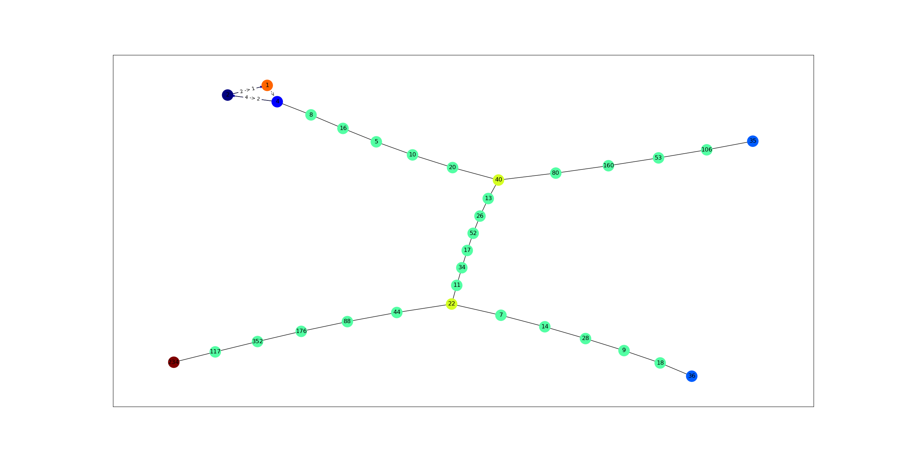

# CollatzSequence

This is a a Collatz sequence calculator designed to compute a Collatz sequence, and then display as a directed graph. 

The Collatz conjecture is one of the most famous unsolved problems in mathematics. It can be described as follows:


<!-- I found the png above here: [https://sites.dartmouth.edu/mathsociety/2019/11/13/new-breakthrough-in-the-82-year-old-riddle-known-as-the-collatz-conjecture/]. It is not my own and I have no claim to it. Check out this document for more information on the Collatz conjecture.  -->

Where n is any positive integer. 

This calculator also accepts multiple inputs and shows how the different sequences converge to 1. 

#Implementation#
Its built using Python 3.10.13, NetworkX, Pygraphviz (and by extension, graphviz), and MatPlotLib. For starters, ensure that you have the latest install of Python or at least python 3.10.13.

Then install graphviz. On a Mac, you can do this by running ```brew install graphviz```. On Windows, you can download the installer from [here](https://graphviz.gitlab.io/_pages/Download/Download_windows.html).

Then in a terminal run ```pip install networkx```, ```pip install matplotlib```, and ```pip install pygraphviz```. Installing pygraphviz can be a bit tricky, so if you run into any issues, check out the [documentation](https://pygraphviz.github.io/documentation/stable/install.html).

When running the application, you should be given a prompt to enter a number. This only works for integers greater than 0. There is error handling built into the application, but it is most likely still possible to crash.

Upon entering a number, you will see in the terminal a display of the sequence until it reaches 1, and a pop-up of the directed graph that is produced. Upon exiting the pop-up, you will then be prompted to enter another number. 

At any time you can exit the application by typing ```exit``` into the terminal.

Here's an example of how a directed graph would look using the inputs 234, 35, and 36. 



I built this because my professor mentioned one day how when he has trouble sleeping, he'll take whatever time it is, and perform the Collatz conjecture on it (I know, crazy right). I looked it up and then saw a bunch of different diagrams showing how different sequences would converge to 1, and I immediately thought how cool it would be to make a script that automatically did it. 

This isn't flawless however. Every time we render a new directed graph, the points are thrown out randomly across the surface. This is something I'm looking into fixing for the future. 

All in all, I'm pretty happy how this came out. If anyone does use this code then I'll consider this project a success!
